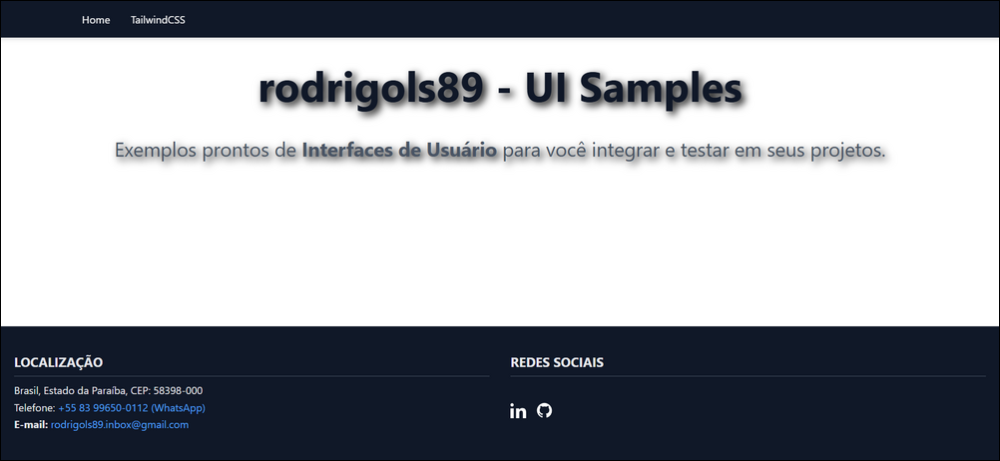
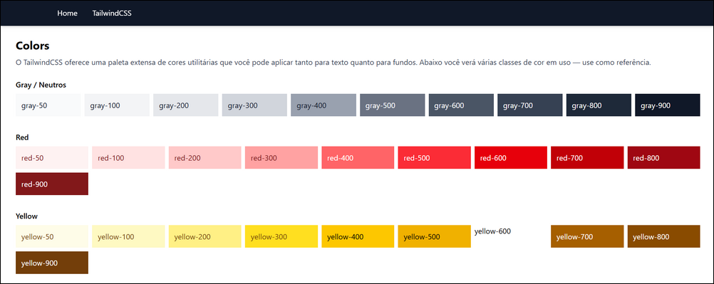

# 🎨 rodrigols89 - UI Examples

[](LICENSE.md)

 - Este projeto foi desenvolvido para servir como um **repositório de exemplos práticos de UI (User Interface)**, combinando **Django** no backend e **TailwindCSS** no frontend.  
 - A ideia é ter uma coleção bem organizada de páginas e componentes, cada um demonstrando **boas práticas modernas de frontend** com código limpo, reutilizável e responsivo.

## Conteúdo

 - [✨ Destaques do Projeto](#destaques-do-projeto)
 - [📂 Estrutura do Projeto](#estrutura-do-projeto)
 - [🚀 Como Executar](#como-executar)
 - [🛠 Tecnologias Utilizadas](#tecnologias)
 - [📸 Pré-visualização](#preview)

---

<div id="destaques-do-projeto"></div>

## ✨ Destaques do Projeto

 - 🖌 **Design Responsivo** com **TailwindCSS**:
   - Exemplos de **spacing, typography, layout, cores, sizing, efeitos de sombra e muito mais**, baseados na documentação oficial do Tailwind.
 - ⚡ **Django Templates**:
   - Organização modular, com **`base.html`**, **`navbar.html`**, **`footer.html`** e páginas específicas (`spacing.html`, `sizing.html`, `typography.html`, etc).
 - 📚 **Formato de Tutorial**:
   - Cada página explica conceitos do Tailwind com exemplos reais, tornando o projeto uma excelente fonte de estudo.
 - 🔗 **Componentes Reutilizáveis**:
   - Navbar, Footer e outras seções prontos para serem adaptados em qualquer aplicação.

---

<div id="estrutura-do-projeto"></div>

## 📂 Estrutura do Projeto

```bash
.
├── core
├── frontend
│    └── templates/
│         ├── components/
│         |    ├── navbar.html
│         |    └── footer.html
│         ├─── pages/
|         |     ├── tailwind
|         |     |    ├── borders.html
|         |     |    ├── core-concepts.html
|         |     |    ├── layout.html
|         |     |    ├── sizing.html
|         |     |    ├── spacing.html
|         |     |    └── typography.html
|         |     └── home.html
├── static/
│   └── (arquivos estáticos: imagens, css, etc.)
└── README.md
```

---

<div id="como-executar"></div>

## 🚀 Como Executar

1. Clone o repositório:
```bash
git clone https://github.com/rodrigols89/rodrigols89-ui-samples.com
cd rodrigols89-ui-samples.com
```

2. Crie e ative um ambiente virtual:
```bash
poetry shell
```

3. Instale as dependências:
```bash
poetry install
```

4. Execute o servidor:
```bash
task start
```

5. Acesse em [http://localhost:8000](http://localhost:8000)

---

<div id="tecnologias"></div>

## 🛠 Tecnologias Utilizadas

 - **Frondend:**
   - [TailwindCSS](https://tailwindcss.com/)
- **Backend:**
   - [Django](https://www.djangoproject.com/)

---

<div id="preview"></div>

## 📸 Pré-visualização

  

  

  

---

⭐ Se este projeto te inspirou, deixe uma estrela no repositório!  
